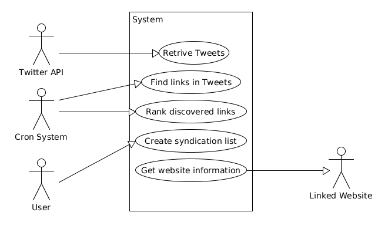
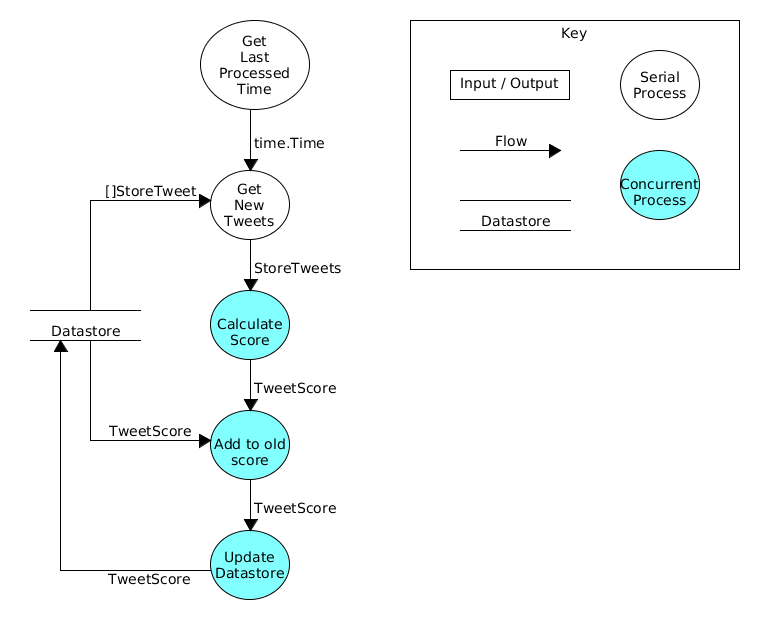

# TweetHarveser

Twitter is an incredibly useful collection of information about many topics, but by its nature that information is distributed across the entire network.  There are people generating content about topics that a user may be interested unless you are actively following those people you will likely miss that content as it flows through the system.  Additionally because every tweet is given equal weight in the stream of data, it can be easy to miss information that is more popular or is of greater value.  

As an example I am working to learn the Go (www.golang.org) programing language, and like to read new articles as they are published.  Many of them are listed on twitter and the really interesting articles are favorited & retweeted, the better or more valuable the article the more it shows up in the network.

Atom is a technology used to provide a simple syndication data format that a user may subscribe to an XML document and find new content as it is published.  This project is an attempt to integrate these two technologies in order to provide information that maximizes the network effect of Twitter to curate data of value, and the simplicity of Atom to syndicate lists of websites.

## Business and Engineering Objectives

|Business Goal (Mission Objective) | Goal Refinement (Engineering Objective)|
|-----|------|
| Collect topic specific links from Twitter. | Periodically search Twitter for new data on a given topic. |
| Determine if a Tweet contains a link. | Provide a ranked and filtered list of topic related links to the user. |
| Determine the relative rank of a link from its popularity on the Twitter network. | Return a list of links to the user of collected links. |

## System Context

The system operates in a simple context with input coming from the Twitter network and after processing being provided to a syndicated list consumer.  The website at the end of the link is also queried for information.  

Internally the system has several additional components which are depicted in the use case diagram below (Figure 2).  As part of processing and providing useful input to the output to the user requires that the system retrieve information  from the websites at the end of links.  For processing and ranking tweets the system must convert short URLs used in Tweets to conserve space (http://t.co/pu1kOdQqhC) to a full length address.  Additionally in order to provide value to the user, the system gets a copy of the website and scrapes the title from the HTML code.  

This use case diagram implies the following functional requirements of the system.

1. The system shall retrieve content from Twitter based on the content of Tweets.
2. The system shall determine if a Tweet has a link.
3. The system shall determine the popularity of a link based upon the number of times that it is listed in a Tweet and how many times those Tweets are favorited by other users.
4. The system shall produce, on request a list of all links discovered, sorted based upon their popularity.
5. The system shall convert shortened addresses to full length addresses.
6. The system shall retrieve the title from linked websites.

Translating these functions into an architecture requires producing quality attributes to support architecture development.  Table 2 shows quality attributes identified for this system.

## Engineering Objectives and Quality attributes
| Engineering Objective | Quality Attribute | Quality Attribute Scenario | Priority | Tactic | Reason |
| --- | --- | ---| ----| ----| ----|
| Periodically search Twitter for new data on a given topic. | Interoperability | The system on a managed basis make a query to the Twitter API and receives a batch of new matching Tweets. | M | Tailor Interface | Utilizing common interfaces between the system and the Twitter API is essential to integrating those systems. |
| Determine if a Tweet contains a link. | Performance | Within 1 second of downloading a tweet the system has determined if the text contains a link. | H | Introduce concurrency |Because of the large volume of Tweets that could be returned and because each Tweet is independent, they may be analysed concurrently to increase performance. |
| Determine the relative rank of a link from its popularity on the Twitter network. | Performance | The system summarizes on an hourly basis new information collected from the Twitter API | H | Schedule resources | Scheduling the most complex task of the process allows for control of resources. |
| Return a list of links to the user of collected links. | Usability | Once the user has requested a summary of new posts the system provides a list in a standard format for consumption | M | Maintain task model | Complying to the consumption format standard (Atom) is essential to producing a readable product for the user.  |

## Workflows or Process Flow Design

## Control Flow
There are two major points at which information is filtered in this system.  First when a tweet is received and it must be determined if it has information of value (a link).  The second is when a list of links must be processed.  Control flows for these processes are shown below.

## Interaction Design

### Architecture Models

| # | Architectural Driver | Priority | (Business Need, Tech Complex) | Source |
|--|--|--|--|
| 1 | Support various inputs and outputs | (H, L) | Supporting the input and output formats of the Twitter API (HTTP/JSON) and Atom (HTTP/XML) are essential for integration |
| 2 | Be highly performant for large volumes of data | (M, M) | Large volumes of data require efficient processing to ensure efficient use of resources. |

The system architecture as developed has three major components, a Map-Reduce pattern for processing the content of tweets and determining their score.  A Tweet Collector that is responsible for serving as the interface to the Twitter API. And the Feed Producer is responsible for providing an Atom feed to the user with the list of ranked tweets.  

### Element Catalog for Module View

| # | Component | Responsibilities |
| --- | --- | --- |
| 1  | Map-Reduce | The system shall determine if a Tweet has a link. | The system shall determine the popularity of a link based upon the number of times that it is listed in a Tweet and how many times those Tweets are favorited by other users. | The system shall convert shortened addresses to full length addresses.
| 2 | TweetCollector | The system shall retrieve content from Twitter based on the content of Tweets. |
| 3 | FeedProducer | The system shall retrieve the title from linked websites. | The system shall produce, on request a list of all links discovered, sorted based upon their popularity. |

### Functional Models
Functional models for this system are depicted using Data Flow Diagrams (DFD).  I have chosen to depict with DFDs  rather than UML class or sequence diagrams because they are a poor mapping to Go’s non-object oriented and concurrent design.  For this exercise the following mappings apply from DFD graphics to Go programming concepts.  Inputs come from the user or external sources.  Flows between processes represent either function calls or channels, which are functionally similar to Unix pipes.  Processes highlighted in blue are run such that each piece of data input into the process is run in a concurrent method to improve performance, especially on events that require network access.

The map function is used to gather information from the Twitter API and convert it to a format that is useful us later in the process.  First we make a request from the Twitter API over HTTP formatted in JSON. The request searches for any tweet with a user specified query from the address. This returns an array of JSON Tweet structs which we convert to a native struct.  Once that is complete we begin processing each tweet through three steps.  First the the text of a tweet is searched for web addresses.  This produces a short address, that address must be converted to a full length address so that we can compare them later and each tweet will have a different short address for each instance of the link in a Tweet.  Once this is done, the struct is stored in the datastore so that it can be processed later.  

This process is automated with a cron job but can be started manually with a call to the endpoint /map?q=golang, where q is the query to search twitter for.

The reduce function is executed after the map function has been run.  It is configured with a cron job that executes the endpoint /reduce.  

The reduce function completes the following tasks.  First it establishes what the last tweet processed was so that all tweets are processed once and only once.  Next a list of all unprocessed tweets are retrieved from the database.  The score for each of these tweets is then calculated as the number of times the tweet has been favorited + 1.  The additional recognizes that the sender is essentially supporting the link by their message.  After a store has been calculated, the system searches the datastore for the current score of that web address.  If there is an existing score, the data is added to the current score.  Then all records are added or updated in the datastore.

The consume process gets a list of all addresses that have been processed in the last seven days.  This set of scores is sorted by the last date the address was active.  That list is passed sent to generate the feed.  In order to produce a description the system retrieves the text of all tweets that have referred to the link then builds a HTML list to include in the feed.  Once all of this information is gathered it is compiled into an XML Atom feed and sent to the user.

## Implementation and Programming
### Libraries and Tools
This system relies on three libraries in order to provide interface with the Twitter API, the Google App Engine Datastore and produce a valid Atom feed in XML.
The Twitter API is provided as HTTP web services with data sent and received in JSON format.  In order to interface with this I used the open source Anaconda library which executes all calls to the API and converts the returned information into native Go structs.  The project is available at: https://github.com/ChimeraCoder/anaconda

Producing a valid Atom Feed requires properly producing an XML document.  In order to do this I used the Gorilla Feeds library, which produces both Atom and RSS feeds upon request. The library is available here: https://github.com/gorilla/feeds

Lastly in order to communicate with the datastore I used the Google App Engine SDK.  Use of the SDK provides methods and structs required to communicate with the provided data store.  The library also wraps some basic language functions with custom versions that work with the App Engine infrastructure, such as logging and custom HTTP transports. The SDK is available for Go, PHP, Python, and Java here: https://cloud.google.com/appengine/docs

By combining these libraries it is possible to build a system that integrates disparate information sources, provide summarization of raw data and return that information back to the user in useful format. A complete copy of the source code is attached and available at https://github.com/AndyNortrup/TweetHarvest.  

## Future work:
This work does not represent a final and complete product, and is best qualified as a proof of concept. Additional work would be needed in order to make this usable by a more general audience including the following:

1. A functional user interface to allow a user to add and subtract items they would like to track and consume.

2. Tests to ensure that the system is functional as additional code is written.

3. Refactoring, much of this code could be improved upon with lessons learned from the development of the system.  Further advantage could be taken of the assets available through the language and the Google App Engine SDK to make this a better performing system that is more robust and better able to handle change.

4. Streamlining could be done to more directly link the map and reduce processes.  

5. Currently they are separate events that are called by individual cron tasks.  Late in the project I realized it would be possible to combine these tasks into a single workflow such that the map process automatically starts and provides information to the reduce process once it is complete.
